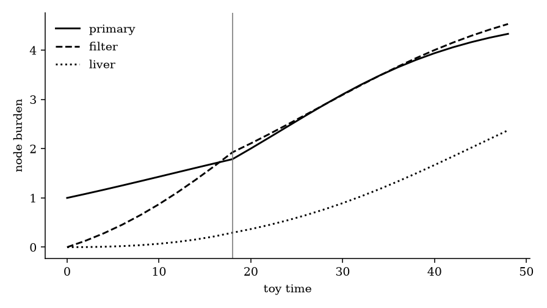
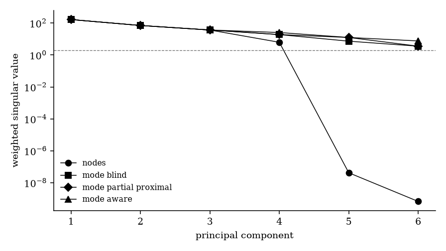
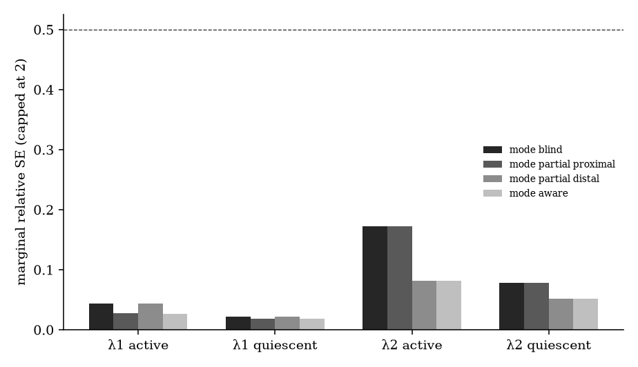
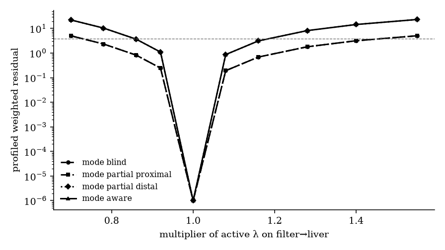

# Occult hybrid mode switches and barrier-augmented metastatic edge-rate identifiability

**Thesis #30. Computational research thesis**  
**Depends on:** Thesis #20 and Thesis #21  
**Author:** Kelechi Emeka Ogbonna  
**Correspondence:** kelechiogbonna300@gmail.com · https://github.com/cloudynirvana/thesis-30-occult-modes-barrier-edge-rates  
**Date:** 21 September 2026  
**Format:** B.Sc. project chapters (Nile University style), written as a computational methods manuscript  
**Status:** A joint hybrid-and-barrier graph toy, plus a seeded numerical check. Not a measurement of metastasis.  
**Citation style:** numbered Vancouver. A `doi:` field appears only where Crossref returned the record.  
**DOI:** none for this document. Do not invent one.

---

## Title page

**OCCULT HYBRID MODE SWITCHES AND BARRIER-AUGMENTED METASTATIC EDGE-RATE IDENTIFIABILITY**

BY

**KELECHI EMEKA OGBONNA**

A COMPUTATIONAL RESEARCH THESIS  
(IN-SILICO JOINT READING OF A HYBRID MODE SWITCH AND AN EDGE CONDUCTANCE)

SUBMITTED AS A CITEABLE MANUSCRIPT FOR JOURNAL / THESIS HANDOFF

PROJECT CONFLUENCE  
INDEPENDENT COMPUTATIONAL RESEARCH

SUPERVISOR: not appointed for this deposit

SEPTEMBER 2026

---

## Declaration

I, Kelechi Emeka Ogbonna, declare that this computational research thesis was carried out by me. The trajectories, Fisher ranks, profiles, alias fit, and noisy cloud reported here were produced by `sim/joint_toy.py` at seed 20260921. The seed governs one noise draw. The ranks and the profiles are deterministic. The numbers are not wet-lab measurements and not patient outcomes. No DOI, ORCID, or journal acceptance was invented for this document. No rank was copied from Thesis #20, and no singular value was copied from Thesis #21.

_________________________     _______________________  
Kelechi Emeka Ogbonna         Date

---

## Abstract

When occult hybrid mode switches and edge-wise desmoplastic conductances coexist on one anatomical graph toy, which metastatic edge rates stay practically identifiable from site-plus-barrier schedules that only see a mode-blind or mode-partial map?

Site burdens do not name them. The toy has three nodes and two directed edges. Each edge carries an active shedding rate, a quiescent multiplier, and one desmoplastic conductance. The field switches once, at a known time, from the active mode to the quiescent mode. Node outputs see only the series flux in the mode that is on. That map has structural rank 4 of 6. Every shedding rate has an unbounded marginal variance.

A site-plus-barrier schedule changes the count. The barrier channel on an edge is either a pair of stalled fractions, one in each mode, or a single duration-weighted pool of those two fractions. The pool carries no mode tag. Under the local rule used here, a marginal relative standard error strictly below one half, the blind pool restores practical rank 6 of 6, and all four shedding rates stay. The widest of those errors is 0.1718, on the active rate of the transport-limited edge.

The profile of that same rate is wider than the local call suggests. On the mode-blind pool, multipliers 0.78 through 1.40 remain inside a χ² cut of 3.841. A mode-partial schedule that resolves only the other edge leaves that interval where it was. A mode-partial schedule that resolves the transport-limited edge, and the mode-aware schedule, both shorten the inside set to multipliers 0.86 through 1.16. The shedding-limited active rate does not need the tag. On the coarse grid, the samples at 0.80 and at 1.25 already sit outside the cut on the blind pool, with weighted residuals 32.16 and 20.92.

A continuous-flow alias, one shedding rate and one conductance per edge for the whole horizon, fitted to the blind record, is practical rank 4 of 4. Its shedding rates are 0.04544 and 0.03699. The hybrid active rates are 0.0800 and 0.0500. The hybrid quiescent rates are 0.0280 and 0.0250. The alias matches none of the four. Its weighted cost is 1826.

The local rule and the profile answer different questions, as they did for a switch time on a different toy. The continuous alias answers a third, and it answers the wrong object. Research only. Not a medical device, and not a cure.

---

## Keywords

hybrid modes; desmoplastic conductance; metastatic edge rate; practical identifiability; profile likelihood; mode-blind schedule; anatomical graph; Fisher information; toy model; research only

---

## Table of Contents

DECLARATION  
ABSTRACT  
Table of Contents  
List of tables and figures  

CHAPTER ONE. INTRODUCTION  
1.1 Background to the study  
1.2 STATEMENT OF RESEARCH PROBLEM  
1.3 JUSTIFICATION OF STUDY  
1.4 AIM AND OBJECTIVES OF THE STUDY  
1.5 SIGNIFICANCE OF THE STUDY  
1.6 SCOPE OF THE STUDY  

CHAPTER TWO. LITERATURE REVIEW  
2.1 An edge rate under one flow is already an under-determined object  
2.2 A mode switch is a different object from a hidden rate  
2.3 Local curvature and a profile need not agree  
2.4 What this deposit does not reopen  

CHAPTER THREE. MATERIALS AND METHODS  
3.1 Design, and a rule against repairing either parent  
3.2 Graph, series flux, and the two barrier maps  
3.3 Parameters, noise, and schedules  
3.4 Propositions  
3.5 Fisher information, profiles, an alias, and one cloud  
3.6 What was not done  

CHAPTER FOUR. RESULTS  
4.1 One switch, and a hyperbola that leaves the nodes alone  
4.2 Ranks under five schedules  
4.3 Profiles of the two active shedding rates  
4.4 The continuous-flow alias is full rank and is neither hybrid rate  
4.5 One noisy cloud collapses, and does not land on the truth  
4.6 Which shedding rates stay  

CHAPTER FIVE. DISCUSSION, CONCLUSION AND RECOMMENDATION  
5.1 Discussion  
5.2 Conclusion  
5.3 Recommendation  

REFERENCES  
DISCLAIMER  

---

## List of tables and figures

**Table 3-1.** Generating edge parameters.  
**Table 3-2.** Schedules.  
**Table 3-3.** Rules fixed in the script before the ranks were read as a claim.  
**Table 4-1.** Structural and practical ranks.  
**Table 4-2.** Marginal relative standard errors of the shedding rates.  
**Table 4-3.** Profile grid for the shedding-limited active rate.  
**Table 4-4.** Profile grid for the transport-limited active rate.  
**Table 4-5.** Continuous-flow alias against the two hybrid rates.  
**Table 4-6.** One noisy draw, six starts.  
**Table 4-7.** Calls. Local stay is the marginal rule. Profile width is the grid.

**Figure 4-1.** Node burdens, with the switch marked.  
**Figure 4-2.** Weighted singular values. The dashed line is the practical cutoff in singular-value units.  
**Figure 4-3.** Marginal relative standard errors of the four shedding rates. The dashed line is one half. Bars are capped at 2.  
**Figure 4-4.** Profiled weighted residual of the transport-limited active rate.

Figures are diagnostics from `sim/joint_toy.py`. They are not scans and not survival curves.

---

# CHAPTER ONE

## 1.0 INTRODUCTION

### 1.1 Background to the study

Secondary growth is not a smaller copy of the lesion that shed it. Paget's seed-and-soil sentence is still the right caution: a cell that leaves one site meets a different tissue, and the meeting is not guaranteed [1]. Later reviews kept the sentence and filled in the steps that sit between detachment and a colony: intravasation, survival in transit, arrest, extravasation, and a variable period in which the arrived cell does not make a mass [2,3]. The hallmarks literature put those steps on a list beside metabolism, angiogenesis, and immune evasion [4–6]. None of that list is a parameter. It is a reminder that a single growth rate, read from a single sum of burden, has already thrown away the route [7,8].

Autopsy series and Markov models of site-to-site passage make the same point in another vocabulary. Metastases are patterned. Some organs receive, some pass traffic onward, and a transition matrix is not a scalar doubling time [9–11]. Mathematical frames for metastatic spread then have a choice. They can write a compartment for each anatomical site and a rate on each edge [12,13], or they can keep one burden coordinate and hope the edge structure is visible in that coordinate's curve [14,15]. The second choice is convenient. It is also the choice that fails when two different edge laws write the same sum.

A second difficulty sits inside a single site. Disseminated cells are not obliged to keep the proliferative field that produced them. Quiescence, angiogenic pause, and immune-held latency are names for pauses that can look alike if the only record is bulk size [16–18]. A hybrid system writes those pauses as modes, with a switch, rather than as one more continuous coefficient smuggled into a smooth vector field [19,20]. Thesis #20 asked which of those switches a sparse delayed scalar can still tell apart. On that deposit's three-coordinate toy, a full state schedule separated the pauses, and a scalar that saw only a lagged burden lost the contrast once the two pauses were given the same burden law. The Fisher information for the contrast dropped to zero. That was a statement about mode identity under a partial observer. It was not a statement about an edge rate on a graph [21].

The graph question was asked separately. Thesis #5 treated metastasis as spreading on an anatomical graph and showed that a lumped burden does not determine edge rates that a site-resolved state can determine, when each edge carries one rate [22]. Thesis #11 put a desmoplastic barrier in a different geometry, a lesion with shells, and showed that a one-state sink cannot carry a split between a core concentration and a spatial mean [23]. Thesis #21 put the conductance on the edge of an organ graph. Under a series law, node burdens see the flux φ = λκ / (λ + κ) and do not see the shedding rate λ and the conductance κ separately. A stalled-fraction reading restores the split, on the schedules where it is taken. On that deposit's four-node continuous-flow toy, lumped burden left practical rank 2 of 6, site-resolved nodes left practical rank 3 of 6, and nodes plus three stalled fractions left practical rank 6 of 6 [24]. Those three integers belong to that toy. They are cited here so the gap is visible. They are not recomputed in this file.

Desmoplasia is the reason a conductance is not a decorative second rate. A dense stroma changes how material moves, and it does so whether or not the modeller writes a coordinate for the matrix [25–28]. Experiments that deplete stromal components change delivery without being, themselves, a proof that an edge rate in a toy is identifiable [29–32]. The matrix is a tissue fact. Identifiability is a property of a map [33]. A response criterion that adds lesions into one sum is a clinical object with a job to do. It is also, for this purpose, a lumped output [34]. A review that moves metastatic biology toward the clinic is not a licence to read a toy rank as a treatment rule [35].

Liquid biopsy is a different partial observer. It is the pattern Thesis #20 used, and it is not the schedule of this deposit. A blood-based genetic record and a minimal-residual-disease assay answer questions this graph does not ask [36,37]. The barrier reading below is a stalled fraction on an edge. It is not a circulating-tumour-DNA threshold.

Structural identifiability asks whether a parameter can be recovered from a noise-free map [38,39]. Practical identifiability asks whether the curvature at a realistic noise scale is enough to keep the parameter inside a useful interval [40–43]. Sloppy spectra are common. A direction can be structurally present and still too flat to use [44–46]. Profile likelihood is the check that does not trust the quadratic [40,42]. Nonlinear fits make that distrust reasonable: the valley need not be an ellipse [46]. Software comparisons and ODE-specific theory say the same thing in different dialects. The method can fail quietly if the observation map was never written down [47–50]. A model that is easy to simulate can still be a bad servant of the question that was asked [51,52].

### 1.2 STATEMENT OF RESEARCH PROBLEM

When occult hybrid mode switches and edge-wise desmoplastic conductances coexist on one anatomical graph toy, which metastatic edge rates stay practically identifiable from site-plus-barrier schedules that only see a mode-blind or mode-partial map?

Thesis #20 limits mode discrimination when the observer is sparse and the modes write similar burden. Thesis #21 restores an edge-rate split from barrier readings when the flow is continuous, one mode for the whole horizon. Neither deposit runs both objects at once. The open question is the joint one. The mode switch and the conductance are on the same edges. The schedules that are allowed to answer are site burdens plus a barrier reading. The barrier reading may be told which mode it belongs to, told the mode on only one edge, or handed a pool that has lost the tag.

### 1.3 JUSTIFICATION OF STUDY

The two parent results do not compose by concatenation. A worker who quotes Thesis #20's zero information for a matched-burden contrast, and then quotes Thesis #21's restoration to rank 6, has not said what happens when the contrast and the conductance are the same experiment. The scalar in the first deposit does not carry an edge index. The series flux in the second deposit does not switch. A joint claim has to be computed on a joint toy.

There is a second reason to recompute rather than to add the integers. Thesis #21's restoration assumes the analyst's model is the continuous flow that generated the data. If the data were generated by a switch, and the analyst still fits one rate per edge, a full practical rank is a rank for the alias. It does not name the active rate, and it does not name the quiescent rate. That confusion is available only on a toy that has both laws.

The local quadratic and the profile already disagreed once, for a switch time, in Thesis #20. A joint toy that reports only a rank would repeat the mistake those authors refused to average away. Both summaries are cheap on a graph this small. Both are in the script.

### 1.4 AIM AND OBJECTIVES OF THE STUDY

The aim is to name which metastatic shedding rates on one hybrid graph stay practically identifiable from site-plus-barrier schedules whose mode map is blind or only partial.

The objectives are:

1. To place a single declared mode switch and an edge-wise conductance on one three-node graph, with soil and switch time known.
2. To compute structural and practical Fisher ranks of the six log-parameters under site burdens, a mode-blind pool, two mode-partial maps, and a mode-aware pair of stalls.
3. To profile the two active shedding rates on grids fixed in the script.
4. To fit a continuous-flow alias to the mode-blind record and to compare its rates with the four hybrid shedding rates.
5. To state the local call and the profile call separately, without importing a table from Thesis #20 or Thesis #21.

### 1.5 SIGNIFICANCE OF THE STUDY

The significance is methodological. It says which observation, on this toy, is doing the work. Site resolution of a switching flux is not the same information as a mode-resolved stall. A pool can remove a kernel and still leave a wide profile on the edge whose stall was pooled. A partial map repairs the edge it resolves and leaves the other edge's profile alone. A continuous model can look identified and still be a compromise between two rates the hybrid model keeps distinct.

That is a claim about a map. It is not a claim about which patients have occult disease, and it is not a proposal to biopsy a barrier.

### 1.6 SCOPE OF THE STUDY

The scope is one toy. Three nodes, two edges, two modes, one switch, known soil, known switch time, Gaussian weights, and a stalled fraction that is a direct function of the rates. The mode names are labels on the two fields. They are not the four fields of Thesis #20, and the nodes are not the four organs of Thesis #21. No assay is simulated. No dose is applied. Seed 20260921 draws the single noisy cloud in Section 4.5. Everything else in Chapter Four is deterministic. Chapter Two cites the parents for the questions they settled. It does not reuse their output files.

---

# CHAPTER TWO

## 2.0 LITERATURE REVIEW

### 2.1 An edge rate under one flow is already an under-determined object

A metastatic rate, written on an edge between two anatomical sites, is not fixed by the fact that metastases are common. Pattern in an autopsy series constrains a transition story. It does not hand the modeller a number [9]. Compartmental and Markov constructions make the missing number explicit. Newton and colleagues treat organs as states of a chain and estimate transitions from patterns of spread [10]. Haeno and colleagues fit a metastatic kinetic model to pancreatic cancer and then talk about treatment. The kinetic fit and the treatment sentence are different acts [11]. Franssen and colleagues write a general framework in which metastatic spread is a process on a structured population, not a decoration of a primary-growth curve [12]. Scott and colleagues show that a secondary deposit can feed the primary in a self-seeding loop, which is another way of saying that the edge is not a one-way leak into a sink [13].

Growth laws for the primary mass are a separate muddle. Several classical curves can look alike over a short window, and the likeness is not evidence that the curve contains an edge [14]. Reviews of the mathematics of cancer are useful here as maps of model classes, not as sources of coefficients [15].

The barrier enters when the edge is allowed two positive rates whose combination, rather than either rate, is what the receiving node feels. Thesis #11 made that point for shells inside one lesion: conductances are what a lumped output can see, and a core coordinate that does not move those conductances is invisible [23]. Thesis #21 moved the same series structure onto organ-graph edges and kept the flow in one mode. The stalled fraction s = λ / (λ + κ) is constant in time when λ and κ are constant. Recorded once, it breaks the hyperbola on which φ is constant. Recorded never, the hyperbola remains, and site-resolved nodes still only name φ [24].

Stromal biology is why the second rate is called a conductance rather than a nuisance parameter. Fibroblasts and matrix alter the space through which cells and drugs move [25,26,33]. Pancreatic tumours are the usual example, because the desmoplastic reaction is hard to ignore and because stromal depletion has been proposed as a way to change delivery [27–32]. Whatcott and colleagues describe desmoplasia in primary and metastatic pancreatic lesions as a histological fact [28]. That fact motivates the symbol κ. It does not calibrate κ. Olive, Provenzano, Stylianopoulos, Jain, and the papers around them are cited here as the experimental setting in which a barrier is a physical object. This toy does not reproduce their measurements [29–32].

A lumped clinical sum has the same algebraic weakness as a lumped toy, for a different reason. RECIST adds selected lesions because trials need a rule [34]. The rule is not an observation map designed for edge-rate identifiability. Using it as if it were is a category error. Reviews that argue for moving metastatic mechanisms toward care are about that care. They are not results of the script [35].

### 2.2 A mode switch is a different object from a hidden rate

Dormancy is the biological name nearest to the quiescent field in this toy. Single disseminated cells can remain long after the primary has been addressed, and the mechanisms proposed for that pause are not one mechanism [16–18]. A modeller who encodes the pause as a smaller continuous growth rate has made a choice. The choice may fit a curve. It does not say whether the data could have distinguished a switch from a permanently slower edge.

Hybrid dynamical systems already have a language for a vector field that changes at an event [19]. Thesis #4 used that language for occult residual disease and refused a particular confusion: occult is not a licence to add an unobserved continuous state and then estimate it as if it had been measured [20]. Thesis #20 kept the named modes and changed the observer. The question became practical. Which switches remain discriminable when the record is a sparse, delayed, censored scalar rather than the full state. The answer was conditional. While the pauses wrote different burden paths, the scalar still separated them at a pairwise error below a predeclared tolerance, and the local standard deviation of the continuous contrast failed that tolerance. When the burden laws were matched, information for the contrast was zero on every map that could not see the class coordinates. Switch time in a mode that never left the proliferative field had information zero on every map [21].

Those sentences are the reason this deposit does not try to rediscover mode identity. The modes here are declared. The switch time is known. What is unknown is whether a barrier schedule that cannot see the mode, or can see it on only one edge, still determines the shedding rates that the two modes use. The partial-observer lesson is used as a constraint on the schedule, not as a result to be pasted.

### 2.3 Local curvature and a profile need not agree

Practical identifiability, in the sense used by Raue and colleagues, is a property of a model, a noise model, and an experimental design together [40,41]. The Fisher information is the curvature of the log-likelihood at the truth. Its inverse, where the inverse exists, is a Cramér–Rao bound under regularity conditions that a flat direction violates. A principal component with relative error below a cutoff can be called practically identifiable even when a coordinate, read marginally, is not. The converse also happens. A coordinate can look acceptable in the margin of a pseudoinverse while a profile along that coordinate, with the other parameters free to compensate, stays inside a likelihood cut for a long way [42,43].

Sloppiness is the spectral version of the same warning. Ordered eigenvalues of the sensitivity matrix often span many decades, and the flat directions are not removed by wishing the parameters were mechanistic [44,45]. Experimental design can move a direction from flat to usable. It cannot invent a column that the observation map has structurally deleted [45]. Nonlinear least squares adds a geometric warning: the coordinates in which the fit is performed need not be the coordinates in which the valley is round [46].

Structural tests ask a prior question. If two parameter values produce the same output for every time and every noise-free initial condition in the class, no estimator will separate them [38,39,47–49]. For partially observed ODEs the tests are technical, and different algorithms disagree on hard examples [48,49]. This deposit does not run a differential-algebra engine. It uses the series formulae, a finite-difference Jacobian, and a singular-value cutoff. That is a numerical structural rank of one map at one parameter value. It is not a global certificate [49,50]. The profile is the second numerical object, and it is allowed to contradict the local standard error. Thesis #20 treated that contradiction as the result for an angiogenic switch time on a scalar. This deposit treats it the same way for an edge rate [21,40].

### 2.4 What this deposit does not reopen

Thesis #20's pairwise errors, lag sweep, and Cramér–Rao standard deviations were computed on a three-coordinate local toy with four modes. They are not recomputed. Thesis #21's ranks, hyperbola twin, and hold-up generator were computed on a four-node graph with three edges and no switch. They are not recomputed. Thesis #5's single-rate restoration and Thesis #11's shell conductances are ancestors of Thesis #21. Their tables stay in those repositories [22,23].

The mode names in Thesis #4 and Thesis #20 include quiescence, angiogenic pause, and immune-held latency beside proliferation [20,21]. This toy has two fields. Calling the second field quiescent is a label, chosen because a multiplier below one is easy to read. It is not a claim that angiogenic pause and immune-held latency have been represented.

No entropy, no stochastic jump process, and no patient-derived transition matrix enters the right-hand side. The cited Markov and framework papers motivate edges. They do not supply λ [10–13].

---

# CHAPTER THREE

## 3.0 MATERIALS AND METHODS

### 3.1 Design, and a rule against repairing either parent

The laboratory is computational. One generator is primary. It is a hybrid series model: two modes, a known switch time, and a conductance on each edge that does not itself switch. A second generator, the continuous alias, uses one mode for the whole horizon and is fitted to data that the hybrid model produced. The alias is a check on mis-specification. It is not a second biological hypothesis.

The script is `sim/joint_toy.py`. Chapter Four quotes `sim/results.json`. Seed 20260921 is used only for the noise draw in Section 4.5. Ranks, the hyperbola twin, and the profiles do not use it.

The rate constants were not edited after the ranks were seen. The fine profile grid sits on the transport-limited active rate because that edge is transport-limited in the generating table, not because a preferred schedule failed. The coarse grid sits on the other active rate. Both grids are constants in the source.

Node names are labels. Primary, filter, and liver are not an atlas and not a staging diagram [9,34].

### 3.2 Graph, series flux, and the two barrier maps

Let the nodes be x = (xP, xF, xL), in toy burden units. Edge 1 runs from primary to filter. Edge 2 runs from filter to liver. On edge e the active shedding rate λe > 0, the conductance κe > 0, and the quiescent multiplier αe > 0 define two shedding rates,

λe(active) = λe, &nbsp; λe(quiescent) = αe λe.

The conductance does not depend on the mode. It is the structural barrier. The series flux and the stalled fraction in mode m are

φe(m) = λe(m) κe / (λe(m) + κe), &nbsp; se(m) = λe(m) / (λe(m) + κe).

Both formulae are the Thesis #21 series, evaluated once in each mode. They are not that deposit's parameter values. Given φ and s in the active mode, λ = φ / (1 − s) and κ = φ / s, for s ∈ (0, 1). The multiplier is then fixed by the quiescent flux,

α = φq κ / (λ (κ − φq)),

provided κ > φq. A mode-resolved pair (sa, sq), together with the two fluxes, therefore determines the triple (λ, κ, α) on that edge by algebra. A single pool does not hand over sa and sq separately.

The switch time is τ = 18. The horizon is T = 48. For t ≤ τ the field is active, including the sample taken at τ. For t > τ the field is quiescent. Node dynamics, with known logistic soil, are

dxP/dt = rP xP (1 − xP/KP) − φ1(m) xP,

dxF/dt = rF xF (1 − xF/KF) − φ2(m) xF + φ1(m) xP,

dxL/dt = rL xL (1 − xL/KL) + φ2(m) xF.

Transfer is conservative. Growth is not. The initial state is (1, 0, 0). The soil vectors, fixed for the whole deposit, are r = (0.12, 0.06, 0.045) and K = (6.0, 4.5, 3.5). These are not the soil vectors of Thesis #21.

Integration is piecewise classical Runge–Kutta with step 0.05. Each piece uses the flux of one mode, so the solver does not straddle the switch inside a step. Samples are taken at t = 0, 2, …, 48, twenty-five instants.

The mode-blind barrier statistic on an edge is the duration-weighted pool

s̄e = (τ/T) se(active) + ((T − τ)/T) se(quiescent).

The weights are 18/48 = 0.375 and 30/48 = 0.625. The pool is one scalar. It is not an average of two tagged readings with a reduced variance. A mode-aware schedule records se(active) and se(quiescent) as two scalars, with the mode tag as part of the record. A mode-partial schedule does one of those things on one edge and the pool on the other.

The stalled fraction does not enter the node equation. It is an observation, available only on schedules that declare it. Because λ, κ, and α are constant, each mode's stall is constant inside that mode. Repeating it at every sample would multiply its information by the number of visits. One reading per declared channel is the harsher design, and it is the one used.

### 3.3 Parameters, noise, and schedules

The parameter is θ = (log λ1, log κ1, log α1, log λ2, log κ2, log α2). Shedding rates in the quiescent mode are not separate coordinates. Their logarithms are sums, log λe + log αe, and their variances are computed from the covariance of that sum.

**Table 3-1.** Generating edge parameters. Fluxes, stalls, and the pool are implied by Section 3.2.

| Edge | λ | κ | α | λ quiescent | φ active | φ quiescent | s active | s quiescent | pool | Active regime |
| --- | --- | --- | --- | --- | --- | --- | --- | --- | --- | --- |
| Primary→filter | 0.0800 | 0.2400 | 0.3500 | 0.02800 | 0.06000 | 0.02507 | 0.2500 | 0.1045 | 0.1590 | shedding-limited (κ > λ) |
| Filter→liver | 0.0500 | 0.0220 | 0.5000 | 0.02500 | 0.01528 | 0.01170 | 0.6944 | 0.5319 | 0.5929 | transport-limited (κ < λ) |

Unrounded values are in `sim/results.json`. The second edge is transport-limited only in the active mode. Its quiescent shedding rate equals its conductance, so that mode is balanced. The label in the table follows the active mode, which is the coordinate the profiles move.

Burden noise is Gaussian with standard deviation 0.05. Each stall or pool has standard deviation 0.02. The ranks use the noise only as a weight. The trajectories that build the sensitivity matrix are noiseless.

**Table 3-2.** Schedules. Every schedule includes the three node burdens at each of the twenty-five times. A tagged stall is one scalar. A pool is one scalar.

| Code | Barrier channels | Mode map |
| --- | --- | --- |
| Nodes | none | no barrier, hence no mode tag |
| Mode-blind | pool on each edge | no mode tag |
| Partial, proximal | both stalls on edge 1, pool on edge 2 | mode-resolved only on primary→filter |
| Partial, distal | pool on edge 1, both stalls on edge 2 | mode-resolved only on filter→liver |
| Mode-aware | both stalls on each edge | mode tag on both edges |

The primary mode-partial map in the problem sentence is the proximal one: the near edge is resolved, the far edge is pooled. The distal map is the swap. It is reported so that a repair is not confused with the accident of which edge was tagged. The continuous alias is not a row of this table. It is a different parameter, defined in Section 3.5.

**Table 3-3.** Rules fixed in the script before the ranks were read as a claim.

| Rule | Value |
| --- | --- |
| Log-parameter finite-difference step | 10−4, central |
| Structural rank | singular values of the weighted sensitivity above 10−6 of the leading value |
| Practical rank | principal relative standard errors strictly below 1/2 |
| Local stay, for one shedding rate | marginal relative standard error strictly below 1/2, and finite |
| Profile cut | weighted residual sum of squares ≤ 3.841 (χ2, 1 df, 95%) |
| Coarse profile grid | multipliers 0.45, 0.65, 0.80, 1, 1.25, 1.60, 2.20 of active λ on edge 1 |
| Fine profile grid | multipliers 0.70, 0.78, 0.86, 0.92, 1, 1.08, 1.16, 1.28, 1.40, 1.55 of active λ on edge 2 |
| Optimiser bounds | λ and κ in [10−4, 2], α in [0.02, 3] |
| Integrator step | 0.05, piecewise at τ |

The one-half rule is the convention used for principal relative standard errors in the parent barrier deposit, so a direction with relative error 0.6 would be called impractical in both places [24]. It is a convention. It was not tightened after the singular values were seen. The profile cut is the same one-degree threshold that deposit used on its profiles [24,40]. A grid point is inside or outside. This manuscript does not replace the grid with an interpolated crossing. Interpolation between a tall residual and a zero residual invents a width the samples did not measure.

### 3.4 Propositions

**Proposition 1 (series collapse).** The node vector field depends on (λe, κe, αe) only through φe(active) and φe(quiescent). Any two parameter values that share those four fluxes produce the same node trajectory.

The proof is substitution. The right-hand side in Section 3.2 is written in φ. The stalled fractions do not appear in it.

**Proposition 2 (rank ceiling).** Let y be any observation built from the node trajectory alone. Let θ be the six log-parameters. The Jacobian Dy/Dθ has rank at most 4. Two fluxes on each of two edges are four scalars, and the chain rule cannot create a fifth independent column from a function of those scalars.

**Proposition 3 (algebraic split).** On one edge, the map (λ, κ, α) → (φa, φq, sa, sq) is locally invertible at the generating value, by the formulae in Section 3.2. The map that replaces (sa, sq) by the pool s̄ is a map from three parameters to three scalars. Local full rank of that map is possible. It does not imply that the singular values are comparable to the mode-resolved map.

Proposition 3 is why a blind schedule can be structurally full rank and still practically wide. The numerical ranks in Chapter Four are the test of that distinction. They are not a substitute for the algebra.

### 3.5 Fisher information, profiles, an alias, and one cloud

The sensitivity matrix S has one column per log-parameter. Column j is the central difference of the schedule's mean output. The weighted matrix is Z = S / σ, row by row. Singular values of Z are the square roots of the eigenvalues of the Fisher information ZT Z. A principal relative standard error is the reciprocal of a singular value, because θ is already logarithmic, so a unit change in θ is a relative change in the positive parameter. Practical rank counts how many of those reciprocals are strictly below one half.

The covariance used for marginal errors is the pseudoinverse that inverts only singular values above 10−8 of the leading value. If a coordinate has non-negligible mass on a discarded right singular vector, its marginal variance is reported as unbounded. That is the correct reading of a kernel. A finite pseudoinverse that quietly drops the kernel would call every coordinate identified.

The quiescent shedding rate is not a coordinate. Its marginal relative variance is Var(log λ) + Var(log α) + 2 Cov(log λ, log α), and it is unbounded if either factor is.

An algebraic Jacobian, with outputs (φa, φq) on both edges plus the barrier channels of the schedule, and with no ODE, is computed as a check on Propositions 2 and 3. Its structural rank is recorded. It is not given a practical rank, because a practical rank needs the noise model of the actual schedule, which the algebraic map does not carry.

The profile of an active shedding rate fixes that coordinate on the declared grid and re-fits the other five log-parameters by bounded trust-region least squares, starting from the truth and walking outward so that each grid point starts at the previous optimum. The target is the noise-free mean of the schedule. The weighted residual sum of squares at the truth is zero by construction. A grid point is inside the cut when the re-fitted residual is at most 3.841. This is a noise-free profile of the map. It is not a profile of one noisy realisation [40,42].

The continuous alias has four log-parameters, (log λ1, log κ1, log λ2, log κ2), and it forces α = 1, so the two modes share a flux. Its barrier prediction is its own stalled fraction, one per edge. It is fitted to the hybrid mode-blind mean: hybrid nodes, and the hybrid pools in the two barrier slots. Four starts are used. The Fisher rank of the alias is computed at the best fit, on the alias's own sensitivity, with the mode-blind noise weights. A full rank at that point means the alias is locally determined as an alias. It does not mean the hybrid rates have been recovered.

The noisy cloud adds one Gaussian draw to the hybrid mean, on the mode-blind schedule and, separately, on the mode-aware schedule. Six starts are used: the truth, and five log-normal perturbations of standard deviation 0.35, clipped to the bounds, from the seeded generator. A fit is retained when its weighted cost is within 3.841 of the best cost on that schedule. The cloud is one draw. It is not a sampling distribution of the estimator [50].

### 3.6 What was not done

The switch time was not estimated. Thesis #20 already separated switch time from mode identity, and this deposit does not reopen that separation [21]. Soil rates were not freed. A hold-up compartment, in the sense of Thesis #21, was not added [24]. The four mode names of Thesis #20 were not placed on this graph. No stochastic metastasis generator was run [10–12]. No differential-algebra identifiability certificate was computed [47,48]. No liquid-biopsy likelihood, with a lag and a floor, was evaluated [21,36,37]. The profiles did not include the quiescent rates as profiled coordinates. Their marginal errors are reported, and the text does not promote those errors into a profile.

Bounds can bind. Every retained optimum in Chapter Four is interior, and the script records optimiser success. A bound hit would have been reported as a bound hit.

---

# CHAPTER FOUR

## 4.0 RESULTS

### 4.1 One switch, and a hyperbola that leaves the nodes alone

Figure 4-1 is the noise-free path. At the switch, primary burden is 1.787 and liver burden is 0.2934. At the horizon, filter burden is 4.530 and liver burden is 2.372. The liver coordinate starts at zero, which is the initial condition, not a finding. The path bends because the fluxes drop when the quiescent field turns on. A reader who wanted a clinical curve will not find one here.

Proposition 1 is not only formal. A twin was built by replacing each active stall with a different value, 0.42 on edge 1 and 0.55 on edge 2, and solving for (λ, κ, α) so that both fluxes on both edges stayed put. The node trajectories agree with root-mean-square error 1.24×10−16. The mode-aware stalls do not. Their root-mean-square difference is 0.1295, and the largest absolute log-parameter shift between the truth and the twin is 0.5188. The nodes are blind to a movement that the stalls see. That is the hyperbola, now with a multiplier in the triple. It is the same geometry Thesis #21 demonstrated for (λ, κ) alone, on a different graph, with different numbers [24].

The algebraic Jacobian agrees with the ceiling. With only the four fluxes as outputs, structural rank is 4. With the blind pools added, structural rank is 6. With either partial barrier map, structural rank is 6. With both mode-resolved pairs, structural rank is 6. The smallest algebraic singular value is 0.002869 on the blind map and on the proximal partial map, and 0.01360 on the distal partial map and on the mode-aware map. Resolving the transport-limited edge moves the floor. Resolving the other edge does not. Proposition 3 said that this was possible. The singular values say that it happened.

### 4.2 Ranks under five schedules

The ODE ranks match the algebraic ceiling. Table 4-1 is the weighted Fisher calculation, which is the one the calls use. Site burdens, seventy-five scalars, have structural rank 4 of 6 and practical rank 4 of 6. Two singular values are numerical zeros. Every marginal variance is unbounded. No shedding rate stays, because a rate that sits on a kernel does not have a standard error.

Every site-plus-barrier schedule has structural rank 6 and practical rank 6. The local convention is met by all six principal directions. The schedules are not equally tight. The worst principal relative standard error is 0.279 on the mode-blind pool and 0.279 on the proximal partial map. It is 0.136 on the distal partial map and 0.131 on the mode-aware map. The condition number of the structural spectrum, leading singular value divided by the sixth, is 46.49 for the blind pool and 21.81 for the mode-aware map. Adding a mode tag on the edge that was already well conditioned does little. Adding it on the transport-limited edge is what halves the condition.

**Table 4-1.** Structural and practical ranks. Practical rank counts principal relative standard errors strictly below 1/2. "Worst" is the largest of those errors. An em dash means the discarded singular values leave the quantity unbounded.

| Schedule | Observations | Structural rank | Practical rank | Worst principal relative SE | Condition |
| --- | --- | --- | --- | --- | --- |
| Nodes | 75 | 4 | 4 | — | 26.47 |
| Mode-blind | 77 | 6 | 6 | 0.279 | 46.49 |
| Partial, proximal | 78 | 6 | 6 | 0.279 | 46.49 |
| Partial, distal | 78 | 6 | 6 | 0.136 | 22.62 |
| Mode-aware | 79 | 6 | 6 | 0.131 | 21.81 |

Table 4-2 is the marginal reading of the same matrices, restricted to the four shedding rates. The two conductances and the two multipliers are identifiable in the same local sense on every barrier schedule. On the blind pool their marginal relative errors are 0.1259 and 0.03666 for the conductances, and 0.03811 and 0.2234 for the multipliers. The wide multiplier is α on the transport-limited edge. The mode-aware map brings that error to 0.1072 and leaves the shedding-limited multiplier at 0.02906. None of these six coordinates is the answer by itself. The answer is the shedding rates, and it is split by edge.

**Table 4-2.** Marginal relative standard errors. Quiescent rates are α λ, with variance taken from the covariance. Nodes are unbounded for all four and are omitted.

| Shedding rate | Mode-blind | Partial, proximal | Partial, distal | Mode-aware |
| --- | --- | --- | --- | --- |
| Edge 1, active | 0.04387 | 0.02702 | 0.04374 | 0.02688 |
| Edge 1, quiescent | 0.02163 | 0.01856 | 0.02123 | 0.01807 |
| Edge 2, active | 0.1718 | 0.1717 | 0.08098 | 0.08097 |
| Edge 2, quiescent | 0.07795 | 0.07790 | 0.05173 | 0.05172 |

Two comparisons are the result, and the third decimal place is doing real work. Resolving edge 1 changes edge 2's active error from 0.1718 to 0.1717. That is not a change. Resolving edge 2 changes it from 0.1718 to 0.08098, which is the mode-aware value to three significant figures. The partial map does not leak identification onto the edge it did not read.

The quiescent rate on edge 2 is locally tighter than the active rate on the same edge (0.07795 against 0.1718 on the blind pool). The covariance between log λ and log α is negative. The product α λ is closer to a flux, and the flux is what the nodes see. Local tightness of the product is not a profile of λ. Section 4.3 profiles λ.

### 4.3 Profiles of the two active shedding rates

Table 4-3 is the coarse grid on the shedding-limited active rate. On every barrier schedule the only inside point is the truth. The neighbours at multipliers 0.80 and 1.25 are outside. On the mode-blind pool their weighted residuals are 32.16 and 20.92. On the mode-aware map they are 81.41 and 57.81. The proximal partial map makes the shedding-limited profile steeper (80.34 at multiplier 0.80), which is what a mode-resolved stall on that edge should do. The distal partial map leaves the blind residuals essentially unchanged (32.35 and 21.03). The local errors in Table 4-2 and this grid agree. The shedding-limited active rate is inside a small neighbourhood on every site-plus-barrier schedule, including the pool.

**Table 4-3.** Coarse profile of active λ on primary→filter. A cell is the weighted residual after the other parameters were re-fitted. Every cell in the table is above 3.841. The truth is zero and is omitted.

| Schedule | ×0.80 | ×1.25 |
| --- | --- | --- |
| Mode-blind | 32.16 | 20.92 |
| Partial, proximal | 80.34 | 57.34 |
| Partial, distal | 32.35 | 21.03 |
| Mode-aware | 81.41 | 57.81 |

The far coarse points are larger still. At multiplier 0.45 the blind residual is 1982 and the mode-aware residual is 2188. Those numbers are not a biological effect size. They say the map notices a halving of this rate.

Table 4-4 is the fine grid on the transport-limited active rate. The picture changes. On the mode-blind pool the inside multipliers run from 0.78 through 1.40. The samples at 0.70 and at 1.55 fall outside, with residuals 5.053 and 5.072. The proximal partial schedule copies this pattern. Its residuals at 0.70 and at 0.78 are 5.057 and 2.351, against 5.053 and 2.349 on the blind pool. Resolving the shedding-limited edge does not shrink the transport-limited profile.

The distal partial schedule and the mode-aware schedule copy each other instead. Inside multipliers run from 0.86 through 1.16. The sample at 0.78 is now outside (residual 10.43 on both), and the sample at 1.28 is outside (8.224 and 8.224). The mode tag on the transport-limited stall is the channel that shortens the profile. The tag on the other stall is not.

**Table 4-4.** Fine profile of active λ on filter→liver. Residuals after re-fitting. The truth is inside on every row and is omitted. "In" lists multipliers at or below 3.841.

| Schedule | ×0.70 | ×0.78 | ×0.86 | ×1.16 | ×1.28 | ×1.40 | ×1.55 | In |
| --- | --- | --- | --- | --- | --- | --- | --- | --- |
| Mode-blind | 5.053 | 2.349 | 0.829 | 0.690 | 1.804 | 3.180 | 5.072 | 0.78–1.40 |
| Partial, proximal | 5.057 | 2.351 | 0.830 | 0.690 | 1.806 | 3.183 | 5.076 | 0.78–1.40 |
| Partial, distal | 22.32 | 10.43 | 3.702 | 3.128 | 8.224 | 14.55 | 23.30 | 0.86–1.16 |
| Mode-aware | 22.32 | 10.43 | 3.702 | 3.128 | 8.224 | 14.55 | 23.30 | 0.86–1.16 |

The local standard error and the profile are not in conflict about which schedule is better. They are in conflict about how wide "better" is. A normal approximation at relative error 0.1718 has a 1.96-standard-deviation half-width of about 0.34 in the log parameter, which is a multiplier interval on the order of 0.71 to 1.40. The blind profile's inside grid, 0.78 to 1.40, is that order of width, and it is not a point. A normal approximation at relative error 0.0810 has a half-width near 0.16, and the mode-aware inside grid, 0.86 to 1.16, matches it. The local call still says "stays" on both schedules, because 0.1718 and 0.0810 are both below one half. The profile says the blind version of that stay covers a forty-percent stretch of the rate. Both statements are in the output. Section 4.6 does not average them.

Every grid point in both profiles returned an optimiser success flag, with the truth unevaluated as an optimisation. The walks moved. On the blind profile of edge 2, free parameters shift by as much as several tenths in log units at the outer multipliers. The residual is small because those parameters compensate, not because the solver failed to move.

### 4.4 The continuous-flow alias is full rank and is neither hybrid rate

Four starts, fitted to the noise-free hybrid mode-blind record, finish at the same weighted cost, 1826. The common estimate is λ = (0.04544, 0.03699) and κ = (0.2402, 0.02540). At that point the alias has structural rank 4 of 4 and practical rank 4 of 4. Principal relative standard errors are 0.0063, 0.0149, 0.0597, and 0.128. By the local rule the alias is a determined object.

It is the wrong object. Table 4-5 sets the estimate beside the two hybrid shedding rates. Absolute log-error against the active rates is 0.566 and 0.301. Against the quiescent rates it is 0.484 and 0.392. The shedding-limited conductance comes back (0.2402 against 0.2400). The transport-limited conductance does not (0.02540 against 0.0220). A full practical rank has selected a point on a continuous model. The point is not the active shedding rate, and it is not the quiescent shedding rate, on either edge.

The cost 1826, on 77 weighted coordinates whose noise-free hybrid residual would be zero, says the alias also fails as a curve fit. Determination and adequacy are different properties [46,51]. Thesis #21's restoration to rank 6 was a restoration inside a continuous model that was the truth. The rank in this section is what that style of model does when the truth has switched [24].

**Table 4-5.** Continuous-flow alias at its least-squares point, against the hybrid generating rates.

| Quantity | Edge 1 | Edge 2 |
| --- | --- | --- |
| Alias λ | 0.04544 | 0.03699 |
| Hybrid active λ | 0.0800 | 0.0500 |
| Hybrid quiescent λ | 0.0280 | 0.0250 |
| Alias κ | 0.2402 | 0.02540 |
| Hybrid κ | 0.2400 | 0.0220 |
| \|log λ − log λactive\| | 0.566 | 0.301 |
| \|log λ − log λquiescent\| | 0.484 | 0.392 |

### 4.5 One noisy cloud collapses, and does not land on the truth

One draw, six starts, seed 20260921. On the mode-blind schedule all six fits are retained and they agree. The common estimate is λ = (0.07694, 0.05147), κ = (0.2872, 0.02064), α = (0.3538, 0.5096). The largest absolute log-error against the truth is 0.1796, which is the primary→filter conductance (0.2872 against 0.2400). The best weighted cost is 78.55, against a noise sum of squares of 85.47 on 77 coordinates.

On the mode-aware schedule the six fits again agree. The estimate is λ = (0.07728, 0.05254), κ = (0.2475, 0.02277), α = (0.3729, 0.4661). The largest absolute log-error is 0.0702. The best cost is 83.05, against a noise sum of squares of 90.52 on 79 coordinates.

**Table 4-6.** One noisy draw. All six starts were retained on both schedules. The range across starts is empty at the printed precision.

| Schedule | Retained | Best cost | Noise sum of squares | Max \|log error\| | Where the error sits |
| --- | --- | --- | --- | --- | --- |
| Mode-blind | 6 of 6 | 78.55 | 85.47 | 0.1796 | κ on primary→filter |
| Mode-aware | 6 of 6 | 83.05 | 90.52 | 0.0702 | interior, smaller |

Uniqueness of the minimiser matches practical rank 6. It is not recovery of the generating vector. The blind draw moves a conductance by about a fifth in relative terms and leaves the active shedding rates closer to the truth than that conductance (0.07694 against 0.0800, and 0.05147 against 0.0500). One draw cannot rank those errors. It can show that a unique fit and a true fit are not the same sentence [40,50].

### 4.6 Which shedding rates stay

The schedules answer the problem sentence in layers. Table 4-7 separates the local rule from the profile grid. The script's Boolean flag implements only the local rule. The profile column is the grid in Section 4.3, read against the same cut.

From site burdens, no shedding rate stays. The marginal variances are unbounded. Structural rank 4 of 6 is the flux ceiling of Proposition 2, reached, not merely approached.

From a mode-blind site-plus-barrier schedule, every shedding rate stays under the local rule. The shedding-limited active rate also stays under the coarse profile, in the only sense that grid supports: both neighbours are outside the cut. The transport-limited active rate stays under the local rule and does not stay as a short profile. Eight of the ten fine-grid multipliers are inside the cut, from 0.78 through 1.40. The quiescent rates stay locally. They were not profiled, and the table does not pretend they were.

From a mode-partial schedule that resolves only the proximal edge, the calls match the blind schedule. Edge 2's active profile is not repaired by a mode tag on edge 1.

From a mode-partial schedule that resolves the distal edge, and from the mode-aware schedule, the transport-limited active profile shortens to 0.86 through 1.16. The local call does not change. It was already a stay. What changes is the width.

The continuous alias is not a row of Table 4-7. It is a warning about reading the wrong parameter. Its own rates stay, in the local sense, inside a model that does not contain the hybrid rates. Section 4.4 is that warning.

**Table 4-7.** Calls. "Stays" under the local rule means marginal relative standard error strictly below 1/2. Profile cells name the coarse or fine grid. Quiescent rates were not profiled. On edge 1, "outside" means the samples at ×0.80 and ×1.25.

| Rate | Nodes, local | Blind, local | Blind profile | Proximal profile | Distal profile | Mode-aware profile |
| --- | --- | --- | --- | --- | --- | --- |
| Edge 1, active | unbounded | stays (0.04387) | outside | outside, steeper | outside, like blind | outside, steeper |
| Edge 1, quiescent | unbounded | stays (0.02163) | not profiled | not profiled | not profiled | not profiled |
| Edge 2, active | unbounded | stays (0.1718) | inside ×0.78–1.40 | inside ×0.78–1.40 | inside ×0.86–1.16 | inside ×0.86–1.16 |
| Edge 2, quiescent | unbounded | stays (0.07795) | not profiled | not profiled | not profiled | not profiled |

The subset that stays, if the word means the local rule, is every shedding rate on every site-plus-barrier schedule in Table 3-2, and no shedding rate from sites alone. The subset that stays as a short profile is smaller. It includes the shedding-limited active rate on the blind pool. It includes the transport-limited active rate, at the shorter width, only when that edge's stall is recorded in both modes. A mode-partial map is not a diluted mode-aware map. It is a map that names the edge it resolved.

---

# CHAPTER FIVE

## 5.0 DISCUSSION, CONCLUSION AND RECOMMENDATION

### 5.1 Discussion

Thesis #20 showed that a partial observer can lose a mode contrast that a fuller schedule keeps, and that a local standard deviation and a profile can disagree about a switch time [21]. Thesis #21 showed that a barrier reading restores an edge-rate split that node burdens, even site-resolved node burdens, cannot see when each edge carries a conductance, and that the restoration is a property of the schedule rather than of the mere presence of a stroma word in the title [24]. The calculation in Chapter Four puts those two objects on one graph.

The mechanism that deletes edge rates from the node record is still the chain rule. Twenty-five samples of three nodes are seventy-five scalars, against six parameters, and the rank is 4. Further sampling of the same nodes cannot create a column that the flux map has collapsed. This is the ceiling Thesis #21 recorded for a continuous series law, moved to a hybrid series law with four fluxes instead of three [24]. A worker who adds visit times, and keeps the observation equal to organ burdens, remains on the level set of the twin in Section 4.1.

The pool does something the nodes cannot. It is one scalar per edge, and it lifts structural rank from 4 to 6. Local practical rank follows, at this noise, with the worst principal relative error at 0.279. That sentence is easy to over-read. Practical rank 6 means every principal direction is below the cutoff. It does not mean every coordinate has the same profile. The transport-limited active rate is the wide coordinate. Its profile under the pool covers multipliers 0.78 through 1.40. The shedding-limited active rate, on a coarser grid, does not. The difference tracks the regime in Table 3-1. Where conductance is the smaller rate, a stall is a sensitive function of how the pair is split, and a pool mixes two different stalls (0.6944 and 0.5319) into 0.5929. Where shedding is the smaller rate, the active stall is 0.2500 and the quiescent stall is 0.1045, and the nodes' two fluxes already do a large share of the separation. The algebra in Proposition 3 allows both edges to be locally full rank. The singular values decide which edge is comfortable.

Mode-partial schedules are edge-wise, and the results are edge-wise. Proximal resolution copies the blind profile of edge 2. Distal resolution copies the mode-aware profile of edge 2. There is no average partial observer in this toy. A protocol that tags the barrier on the primary outflow and pools the distal edge has not bought the distal rate's short profile. The acquisition has to sit on the edge whose rate is in doubt. That is a design sentence about this graph. It is not a biopsy plan [34,35].

The alias is the result that keeps Thesis #21's rank from being quoted as if the flow had been allowed to switch. A continuous model with practical rank 4 of 4, worst principal relative error 0.128, is a success by the local rule inside its own parameter. Fitted to hybrid data, it returns shedding rates that miss both modes, and it misses them at a weighted cost of 1826. The conductance on the shedding-limited edge happens to come back. A reader who checked only κ on that edge would be reassured by the wrong test. Adequacy of the curve and identity of the rate are both required, and the alias fails the first and fails the second for λ [46,51,52].

The single noisy cloud agrees with the ranks about uniqueness and disagrees with any hope that uniqueness is accuracy. Six starts, one draw, one retained point. The mode-aware point sits closer to the truth in log distance (0.0702 against 0.1796). The blind point's largest error is a conductance, not the active shedding rate that the profile called wide. One draw is allowed to do that. The profile, not the draw, is the summary of the valley [40,50].

What this deposit does not show is also definite. It does not show that a mode tag is useless. On the transport-limited edge the tag halves the local error and shortens the profile. It does not show that a pool is useless. The pool is what removes the kernel. It does not show that quiescent rates are profile-identified. They are locally finite, and the negative covariance that makes λq tighter than λ is a statement about the product, which is close to a flux the nodes already see. It does not estimate the switch time. A schedule that also hides τ would be a different map, and Thesis #20 is the reason to expect the information for a switch that does not change the field to be zero [21]. It does not represent angiogenic pause or immune-held latency as separate edges [16–18,20]. Two fields are the joint object. Four fields would be a different thesis.

The names on the nodes are the remaining temptation. Filter and liver appear in metastatic pattern papers because those organs appear in patients [2,3,9]. Here they are indices. A rank on index 2 is not a claim about hepatic metastasis. The same restraint applies to the word occult. In the parent deposits it is a predicate on a detection floor together with a pause [20,21]. Here the mode tag is either present in the schedule or absent. Absence of a tag is an experimental design. It is not a diagnosis [36,37].

### 5.2 Conclusion

When a hybrid mode switch and an edge-wise conductance sit on one three-node graph, site burdens leave every metastatic shedding rate unidentified. Structural rank is 4 of 6. A mode-blind, duration-weighted stall on each edge restores local practical rank to 6 of 6, and every shedding rate then has marginal relative standard error below one half. The shedding-limited active rate has a coarse profile whose neighbours at 0.80 and 1.25 lie outside the χ² cut on that blind schedule. The transport-limited active rate does not. Its inside set runs from multiplier 0.78 to 1.40 until its own stall is recorded in both modes, which shortens the set to 0.86 through 1.16. A mode tag on the other edge does not shorten it. A continuous-flow alias of the blind record is itself practically full rank and coincides with neither hybrid shedding rate.

### 5.3 Recommendation

1. Report the local practical rank and the profile of the widest shedding coordinate. Do not let rank 6 stand in for the grid.
2. If a barrier schedule is mode-partial, state which edge was resolved. Do not describe the schedule as "partial" without an index.
3. Do not fit a continuous series model to a record that was generated by a switch and then describe the fit's rates as the metastatic edge rates. Check the fit against both modes, and check the residual.
4. Keep switch time and soil fixed when the question is the edge-rate split, or else declare them as extra parameters and recompute the rank. This deposit fixed them.
5. Cite Thesis #20 for mode discrimination under a partial observer, and Thesis #21 for barrier restoration under continuous flow. Recompute a joint claim on a joint toy. Do not paste either results file into the joint table [21,24].
6. Leave dosing, staging rules, device claims, and clinical decision rules outside papers of this type [34,35,52].
7. A document DOI, if one is minted later, belongs in `CITATION.cff` only after it exists. The hub is an index, not a DOI [53].

---

## REFERENCES

Journal items use Vancouver form. DOI strings are those returned by Crossref for the cited version; letter case in a DOI is not significant. Internet items have no `doi:` field. This document has no DOI.

1. Paget S. The distribution of secondary growths in cancer of the breast. Lancet. 1889;133(3421):571-573. doi:10.1016/S0140-6736(00)49915-0.
2. Fidler IJ. The pathogenesis of cancer metastasis: the 'seed and soil' hypothesis revisited. Nat Rev Cancer. 2003;3(6):453-458. doi:10.1038/nrc1098.
3. Chambers AF, Groom AC, MacDonald IC. Dissemination and growth of cancer cells in metastatic sites. Nat Rev Cancer. 2002;2(8):563-572. doi:10.1038/nrc865.
4. Hanahan D, Weinberg RA. Hallmarks of cancer: the next generation. Cell. 2011;144(5):646-674. doi:10.1016/j.cell.2011.02.013.
5. Valastyan S, Weinberg RA. Tumor metastasis: molecular insights and evolving paradigms. Cell. 2011;147(2):275-292. doi:10.1016/j.cell.2011.09.024.
6. Lambert AW, Pattabiraman DR, Weinberg RA. Emerging biological principles of metastasis. Cell. 2017;168(4):670-691. doi:10.1016/j.cell.2016.11.037.
7. Massagué J, Obenauf AC. Metastatic colonization by circulating tumour cells. Nature. 2016;529(7586):298-306. doi:10.1038/nature17038.
8. Welch DR, Hurst DR. Defining the hallmarks of metastasis. Cancer Res. 2019;79(12):3011-3027. doi:10.1158/0008-5472.CAN-19-0458.
9. diSibio G, French SW. Metastatic patterns of cancers: results from a large autopsy study. Arch Pathol Lab Med. 2008;132(6):931-939. doi:10.5858/2008-132-931-MPOCRF.
10. Newton PK, Mason J, Bethel K, Bazhenova L, Nieva J, Norton L, et al. Spreaders and sponges define metastasis in lung cancer: a Markov chain Monte Carlo mathematical model. Cancer Res. 2013;73(9):2760-2769. doi:10.1158/0008-5472.CAN-12-4488.
11. Haeno H, Gonen M, Davis MB, Herman JM, Iacobuzio-Donahue CA, Michor F. Computational modeling of pancreatic cancer reveals kinetics of metastasis suggesting optimum treatment strategies. Cell. 2012;148(1-2):362-375. doi:10.1016/j.cell.2011.11.060.
12. Franssen LC, Lorenzi T, Burgess AEF, Chaplain MAJ. A mathematical framework for modelling the metastatic spread of cancer. Bull Math Biol. 2019;81(6):1965-2010. doi:10.1007/s11538-019-00597-x.
13. Scott JG, Basanta D, Anderson ARA, Gerlee P. A mathematical model of tumour self-seeding reveals secondary metastatic deposits as drivers of primary tumour growth. J R Soc Interface. 2013;10(82):20130011. doi:10.1098/rsif.2013.0011.
14. Gerlee P. The model muddle: in search of tumor growth laws. Cancer Res. 2013;73(8):2407-2411. doi:10.1158/0008-5472.CAN-12-4355.
15. Altrock PM, Liu LL, Michor F. The mathematics of cancer: integrating quantitative models. Nat Rev Cancer. 2015;15(12):730-745. doi:10.1038/nrc4029.
16. Aguirre-Ghiso JA. Models, mechanisms and clinical evidence for cancer dormancy. Nat Rev Cancer. 2007;7(11):834-846. doi:10.1038/nrc2256.
17. Sosa MS, Bragado P, Aguirre-Ghiso JA. Mechanisms of disseminated cancer cell dormancy: an awakening field. Nat Rev Cancer. 2014;14(9):611-622. doi:10.1038/nrc3793.
18. Phan TG, Croucher PI. The dormant cancer cell life cycle. Nat Rev Cancer. 2020;20(7):398-411. doi:10.1038/s41568-020-0263-0.
19. Goebel R, Sanfelice RG, Teel AR. Hybrid dynamical systems. IEEE Control Syst. 2009;29(2):28-93. doi:10.1109/MCS.2008.931718.
20. Ogbonna KE. Occult residual disease as a hybrid switching system: named modes, switching observables, and a refusal to smuggle continuous Θ [Internet]. Thesis #4 computational research thesis. 2026 [cited 2026 Sep 21]. Available from: https://github.com/cloudynirvana/thesis-04-occult-hybrid-switching
21. Ogbonna KE. Hybrid occult mode switches under sparse delayed liquid-biopsy-style partial observers [Internet]. Thesis #20 computational research thesis. 2026 [cited 2026 Sep 21]. Available from: https://github.com/cloudynirvana/thesis-20-occult-modes-partial-liquid-biopsy-observer
22. Ogbonna KE. Metastasis as stochastic spreading on organ-to-organ anatomical graphs: adequacy of local tumour-burden ODEs under lumped outputs [Internet]. Thesis #5 computational research thesis. 2026 [cited 2026 Sep 21]. Available from: https://github.com/cloudynirvana/thesis-05-metastasis-anatomical-graphs
23. Ogbonna KE. Spatial transport identifiability in desmoplastic tumours: when a lumped burden ODE cannot represent a fibrotic delivery barrier [Internet]. Thesis #11 computational research thesis. 2026 [cited 2026 Sep 21]. Available from: https://github.com/cloudynirvana/thesis-11-desmoplastic-transport-identifiability
24. Ogbonna KE. Anatomical metastasis graphs with edge-wise desmoplastic conductances: lumped burden and edge-rate identifiability [Internet]. Thesis #21 computational research thesis. 2026 [cited 2026 Sep 21]. Available from: https://github.com/cloudynirvana/thesis-21-metastasis-graph-barrier-conductances
25. Kalluri R. The biology and function of fibroblasts in cancer. Nat Rev Cancer. 2016;16(9):582-598. doi:10.1038/nrc.2016.73.
26. Pickup MW, Mouw JK, Weaver VM. The extracellular matrix modulates the hallmarks of cancer. EMBO Rep. 2014;15(12):1243-1253. doi:10.15252/embr.201439246.
27. Neesse A, Michl P, Frese KK, Feig C, Cook N, Jacobetz MA, et al. Stromal biology and therapy in pancreatic cancer. Gut. 2011;60(6):861-868. doi:10.1136/gut.2010.226092.
28. Whatcott CJ, Diep CH, Jiang P, Watanabe A, LoBello J, Sima C, et al. Desmoplasia in primary tumors and metastatic lesions of pancreatic cancer. Clin Cancer Res. 2015;21(15):3561-3568. doi:10.1158/1078-0432.CCR-14-1051.
29. Provenzano PP, Cuevas C, Chang AE, Goel VK, Von Hoff DD, Hingorani SR. Enzymatic targeting of the stroma ablates physical barriers to treatment of pancreatic ductal adenocarcinoma. Cancer Cell. 2012;21(3):418-429. doi:10.1016/j.ccr.2012.01.007.
30. Olive KP, Jacobetz MA, Davidson CJ, Gopinathan A, McIntyre D, Honess D, et al. Inhibition of Hedgehog signaling enhances delivery of chemotherapy in a mouse model of pancreatic cancer. Science. 2009;324(5933):1457-1461. doi:10.1126/science.1171362.
31. Stylianopoulos T, Martin JD, Chauhan VP, Jain SR, Diop-Frimpong B, Bardeesy N, et al. Causes, consequences, and remedies for growth-induced solid stress in murine and human tumors. Proc Natl Acad Sci U S A. 2012;109(38):15101-15108. doi:10.1073/pnas.1213353109.
32. Jain RK. Normalizing tumor microenvironment to treat cancer: bench to bedside to biomarkers. J Clin Oncol. 2013;31(17):2205-2218. doi:10.1200/JCO.2012.46.3653.
33. Cox TR. The matrix in cancer. Nat Rev Cancer. 2021;21(4):217-238. doi:10.1038/s41568-020-00329-7.
34. Eisenhauer EA, Therasse P, Bogaerts J, Schwartz LH, Sargent D, Ford R, et al. New response evaluation criteria in solid tumours: revised RECIST guideline (version 1.1). Eur J Cancer. 2009;45(2):228-247. doi:10.1016/j.ejca.2008.10.026.
35. Wan L, Pantel K, Kang Y. Tumor metastasis: moving new biological insights into the clinic. Nat Med. 2013;19(11):1450-1464. doi:10.1038/nm.3391.
36. Crowley E, Di Nicolantonio F, Loupakis F, Bardelli A. Liquid biopsy: monitoring cancer-genetics in the blood. Nat Rev Clin Oncol. 2013;10(8):472-484. doi:10.1038/nrclinonc.2013.110.
37. Pantel K, Alix-Panabières C. Liquid biopsy and minimal residual disease — latest advances and implications for cure. Nat Rev Clin Oncol. 2019;16(7):409-424. doi:10.1038/s41571-019-0187-3.
38. Bellman R, Åström KJ. On structural identifiability. Math Biosci. 1970;7(3-4):329-339. doi:10.1016/0025-5564(70)90132-X.
39. Cobelli C, DiStefano JJ. Parameter and structural identifiability concepts and ambiguities: a critical review and analysis. Am J Physiol. 1980;239(1):R7-R24. doi:10.1152/ajpregu.1980.239.1.R7.
40. Raue A, Kreutz C, Maiwald T, Bachmann J, Schilling M, Klingmüller U, et al. Structural and practical identifiability analysis of partially observed dynamical models by exploiting the profile likelihood. Bioinformatics. 2009;25(15):1923-1929. doi:10.1093/bioinformatics/btp358.
41. Raue A, Kreutz C, Maiwald T, Klingmüller U, Timmer J. Addressing parameter identifiability by model-based experimentation. IET Syst Biol. 2011;5(2):120-130. doi:10.1049/iet-syb.2010.0061.
42. Kreutz C, Raue A, Kaschek D, Timmer J. Profile likelihood in systems biology. FEBS J. 2013;280(11):2564-2571. doi:10.1111/febs.12276.
43. Wieland FG, Hauber AL, Rosenblatt M, Tönsing C, Timmer J. On structural and practical identifiability. Curr Opin Syst Biol. 2021;25:60-69. doi:10.1016/j.coisb.2021.03.005.
44. Gutenkunst RN, Waterfall JJ, Casey FP, Brown KS, Myers CR, Sethna JP. Universally sloppy parameter sensitivities in systems biology models. PLoS Comput Biol. 2007;3(10):e189. doi:10.1371/journal.pcbi.0030189.
45. Apgar JF, Witmer DK, White FM, Tidor B. Sloppy models, parameter uncertainty, and the role of experimental design. Mol Biosyst. 2010;6(10):1890-1900. doi:10.1039/b918098b.
46. Transtrum MK, Machta BB, Sethna JP. Why are nonlinear fits to data so challenging? Phys Rev Lett. 2010;104(6):060201. doi:10.1103/PhysRevLett.104.060201.
47. Villaverde AF, Barreiro A, Papachristodoulou A. Structural identifiability of dynamic systems biology models. PLoS Comput Biol. 2016;12(10):e1005153. doi:10.1371/journal.pcbi.1005153.
48. Chis OT, Banga JR, Balsa-Canto E. Structural identifiability of systems biology models: a critical comparison of methods. PLoS One. 2011;6(11):e27755. doi:10.1371/journal.pone.0027755.
49. Miao H, Xia X, Perelson AS, Wu H. On identifiability of nonlinear ODE models and applications in viral dynamics. SIAM Rev. 2011;53(1):3-39. doi:10.1137/090757009.
50. Lillacci G, Khammash M. Parameter estimation and model selection in computational biology. PLoS Comput Biol. 2010;6(3):e1000696. doi:10.1371/journal.pcbi.1000696.
51. May RM. Uses and abuses of mathematics in biology. Science. 2004;303(5659):790-793. doi:10.1126/science.1094442.
52. Saltelli A, Bammer G, Bruno I, Charters E, Di Fiore M, Didier E, et al. Five ways to ensure that models serve society: a manifesto. Nature. 2020;582(7813):482-484. doi:10.1038/d41586-020-01812-9.
53. Ogbonna KE. Research theses hub [Internet]. 2026 [cited 2026 Sep 21]. Available from: https://github.com/cloudynirvana/research-theses-hub

---

## Disclaimer

This manuscript is computational research by Kelechi Emeka Ogbonna. The graph, the switch, the ranks, and the profiles are toy objects. They are not a medical device, not clinical decision support, not a dose, and not a cure. Node names are not an atlas. A stalled fraction is not an assay. No document DOI is registered.
